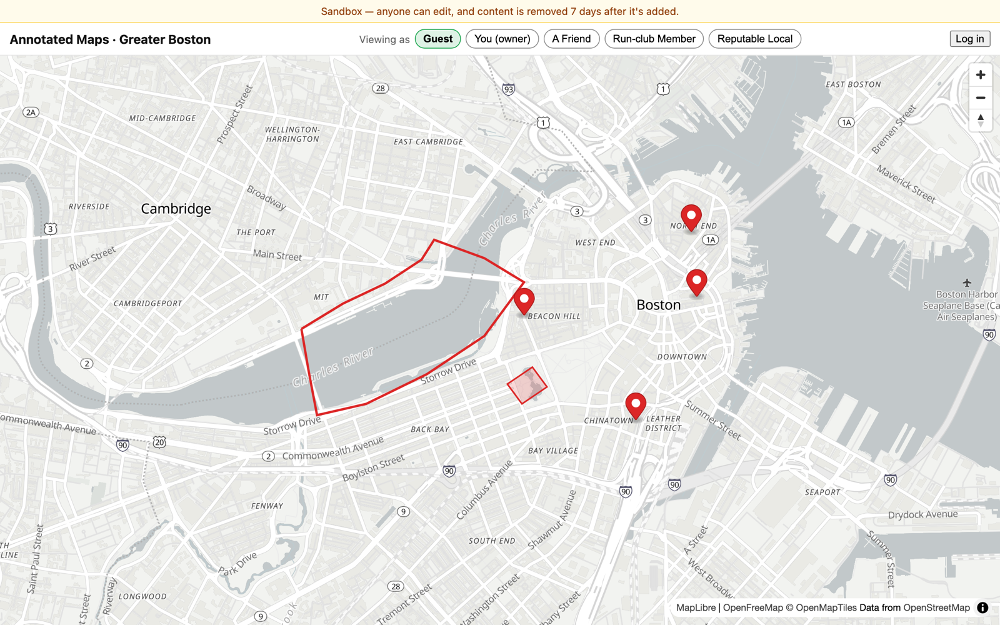
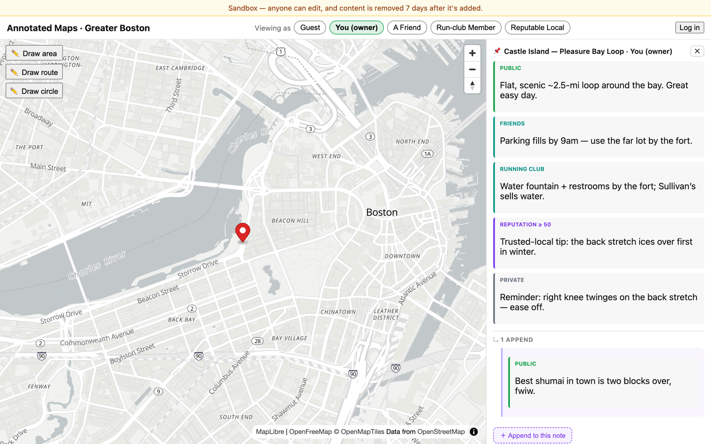

# Annotated Maps

[](https://annotated-maps-web.onrender.com/)

A multi-tenant, permissioned map-annotation platform. Teams can create and share annotated map layers with fine-grained access control. The Django/PostGIS backend exposes a JSON API; a Vite/TypeScript frontend renders interactive maps. See `docs/superpowers/specs/` for design documents and `docs/architecture/production-lenses.md` for the architectural backlog.

**▶ Live demo: https://annotated-maps-web.onrender.com/** — a public Boston sandbox (free-tier hosting, so the first load may take ~30s while the instance wakes).

**▶ [Evaluating this repo?](docs/for-reviewers.md)** — a three-minute map to the strongest evidence, what each milestone proves, and the honest parts (what broke, what my own review missed, what I chose not to build).

**▶ [Production-engineering roadmap](ROADMAP.md)** — Kubernetes/Helm, OpenTelemetry, Terraform + EKS, and a one-button ephemeral pipeline: all four milestones shipped, with proof links for each.

**▶ [Live telemetry dashboard](https://friendlynewt1033.grafana.net/public-dashboards/20407e8eaf204a899c3feb0af005935d)** — request rate, latency, and error ratio from the demo above, instrumented with OpenTelemetry and exported to Grafana Cloud (public, no login).

## Section-level visibility

Every note is composed of **sections**, each gated to a different audience — public, friends, a group, a reputation threshold, or private. The same note shows different content depending on who is viewing it; switch personas with the **"Viewing as"** control to watch the markers and detail panel re-filter live.



## Local development

### Backend

```bash
# 1. Start the database (PostGIS)
cd backend && docker compose up -d db

# 2. Configure environment
cp .env.example .env   # edit as needed

# 3. Install dependencies and run
uv sync
uv run python manage.py migrate
uv run python manage.py runserver
```

Health check: http://localhost:8000/api/v1/health

#### macOS GDAL note

On macOS, if `manage.py` fails with **"Could not find the GDAL library"** (Homebrew ships a GDAL version newer than Django's auto-probe range), set `GDAL_LIBRARY_PATH` in `backend/.env`:

```
GDAL_LIBRARY_PATH=/usr/local/lib/libgdal.dylib
# or, using Homebrew's prefix:
# GDAL_LIBRARY_PATH=$(brew --prefix gdal)/lib/libgdal.dylib
```

The `.env.example` already has this line commented out. This is not needed on Linux, CI, or Docker.

### Frontend

```bash
cd frontend && npm install && npm run dev
```

Dev server: http://localhost:5173 — the Vite dev server proxies `/api` to the
Django backend on :8000, so run the backend alongside it.

To see the Boston demo (the section-visibility "Viewing as" map), seed it once:

```bash
cd backend && uv run python manage.py seed_demo
```

Then open the dev server and switch personas (Guest / A Friend / Run-club Member /
Reputable Local / owner) to watch the markers and note panel re-filter live.

## Run it on Kubernetes

The app ships as a Helm chart (`deploy/helm/annotated-maps`) that runs end-to-end
on a local [kind](https://kind.sigs.k8s.io/) cluster:

```bash
make kind-up    # one-time cluster (ingress + metrics-server included)
make deploy     # build, load, install — app at http://localhost/
```

New to Kubernetes? Start with the [Kubernetes primer](docs/kubernetes-primer.md).
Design rationale: [ADR-0007](docs/adr/0007-migrations-via-helm-hooks.md) and the
[milestone spec](docs/superpowers/specs/2026-07-08-helm-kind-milestone-design.md).

Milestone 3 takes the same chart to AWS (Terraform + EKS) — provisioned, [verified serving through an ALB](docs/m3-demo-run.md), and destroyed to zero on demand. See the [AWS primer](docs/aws-primer.md) for how it works.

Milestone 4 wraps that whole lifecycle in one button: a [GitHub Actions pipeline](.github/workflows/demo-pipeline.yml) that provisions the environment, gates the images on a Trivy scan, deploys, runs Playwright against the live URL, and destroys everything — with teardown guaranteed even when a step fails. [The run record](docs/m4-pipeline.md) has the screenshot the pipeline took of the app running on EKS, and what four red runs taught us.

## Tests

```bash
# Backend
cd backend && uv run pytest

# Frontend
cd frontend && npm run test -- --run
```

## Deploy

`render.yaml` is a [Render Blueprint](https://render.com/docs/blueprint-spec) that provisions:

- **annotated-maps-api** — Docker service running the Django/Gunicorn backend
- **annotated-maps-web** — static site serving the compiled Vite SPA

- **annotated-maps-reaper** — Docker cron job that reaps ephemeral sandbox notes daily

The database is external (Neon Postgres + PostGIS); set the `DATABASE_URL` environment variable per environment in the Render dashboard. `DJANGO_ALLOWED_HOSTS` must also be set per environment to include the service's public hostname. See `docs/DEPLOY.md` for the full runbook.
