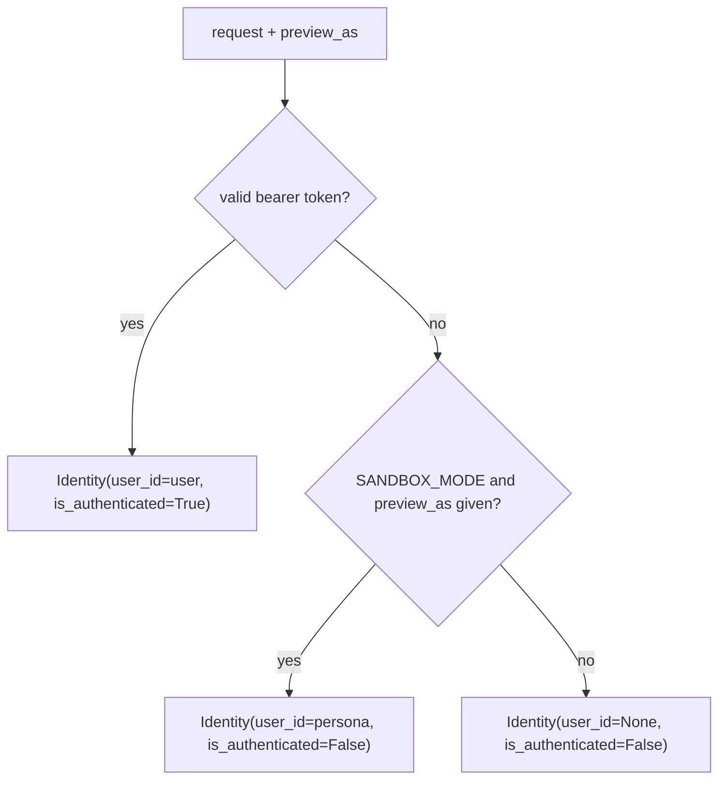

<!-- doc-status: dated -->

# Authentication and identity

- Date: 2026-07-21
- Prerequisites: [the domain model](foundation-domain-model.md) (`User`,
  `AuthSession`, blank-password accounts). Pairs with [the visibility
  model](foundation-visibility-model.md) and [the write
  path](write-path.md), both of which start by resolving an identity — this is
  the tour of *how* that resolution works.
- Describes: `backend/core/auth.py` (the mechanism) and `backend/core/auth_api.py`
  (signup / login / logout / me).

Every request that reads or writes begins the same way: the caller is resolved
into an **`Identity`**. There are exactly two ways to *be* someone — a real
logged-in user (a bearer token) or, only on the public demo, a previewed persona
— and a third state, **guest**, for nobody. Getting that resolution right is a
security boundary, so it lives in one small function with one rule.

---

## 1. `Identity` and the one resolution rule

`Identity` is a tiny frozen value: who the caller is, and whether they proved it.

```python
@dataclass(frozen=True)
class Identity:
    user_id: UUID | None   # the viewer/author id; None = guest
    is_authenticated: bool  # True only when resolved from a bearer token
```

`resolve_identity` produces it, and the **precedence is the whole point**:



```python
def resolve_identity(request, preview_as):
    user = authed_user(request)
    if user is not None:
        return Identity(user_id=user.id, is_authenticated=True)   # bearer ALWAYS wins
    if settings.SANDBOX_MODE and preview_as is not None:
        return Identity(user_id=preview_as, is_authenticated=False)  # persona preview
    return Identity(user_id=None, is_authenticated=False)            # guest
```

Two properties fall out, and both are load-bearing:

- **A real login always wins.** `preview_as` is only consulted when there is *no*
  authenticated user, so a persona preview can never override or impersonate a
  logged-in caller.
- **`preview_as` is sandbox-only.** Outside `SANDBOX_MODE` the parameter is
  ignored entirely — it is a demo affordance ("view the map as this persona"),
  not an authorization mechanism.

The `is_authenticated` flag carries the *difference* forward: downstream code
(e.g. [`authorize_write`](write-path.md)) treats a real login and an anonymous
sandbox persona differently even when both have a `user_id`. A persona can author
sandbox content but is never treated as a proven identity.

## 2. Sessions are bearer tokens, stored only as hashes

A logged-in session is a **bearer token**: a long random string the client sends
back as `Authorization: Bearer <token>`. The security-relevant choice is what the
server keeps:

```python
def create_session(user, request):
    raw = secrets.token_urlsafe(32)          # 256 bits of randomness
    AuthSession.objects.create(
        user=user,
        token_hash=hash_token(raw),          # store the HASH, never the token
        expires_at=timezone.now() + SESSION_TTL,   # 14 days
        created_ip=_client_ip(request),
        user_agent=request.META.get("HTTP_USER_AGENT", "")[:300],
    )
    return raw                               # the raw token is returned ONCE, to the client
```

The database row holds only the **SHA-256 hash** of the token, its expiry, and
some provenance (IP, user agent). Verifying an incoming request hashes the
presented token and looks for a matching, non-expired row:

```python
def authed_user(request):
    token = bearer_token(request)
    if not token:
        return None
    session = AuthSession.objects.filter(
        token_hash=hash_token(token), expires_at__gt=timezone.now()
    ).select_related("user").first()
    return session.user if session else None
```

- **A leaked database row can't be replayed.** The stored hash isn't the token;
  an attacker who reads the row can't reconstruct the bearer value from it.
- **A fast hash is the *correct* choice here** — and this is the subtle part. The
  token is 256 bits of true randomness, so there's nothing to brute-force; a slow
  key-derivation function (bcrypt/PBKDF2) buys nothing. Slow KDFs exist to defend
  *low-entropy* secrets — passwords — which is exactly the next section.

## 3. Signup, login, logout

`auth_api.py` is a small django-ninja router. Passwords (unlike tokens) are
low-entropy human secrets, so they go through Django's slow hasher:

```python
user = User.objects.create(
    email=payload.email,
    password=make_password(payload.password),   # PBKDF2 — deliberately slow
    display_name=payload.display_name,
)
```

Signup rejects a duplicate email (a `409`, guarded both by an explicit check and
by catching the `IntegrityError` from the unique constraint — the race-safe
belt-and-braces), and enforces a minimum password length in the schema.

**Login is written to leak nothing** — not even whether an email is registered:

```python
user = User.objects.filter(email=payload.email).first()
# ALWAYS run a hash check (dummy hash when no user / blank password) so response
# timing doesn't reveal whether the email exists. Generic error → no enumeration.
stored = user.password if user and user.password else make_password(None)
password_ok = check_password(payload.password, stored)
if user is None or not user.password or not password_ok:
    raise HttpError(401, "Invalid email or password.")
```

Two defenses in those five lines:

- **No user enumeration.** A missing email and a wrong password return the *same*
  generic `401`, and — crucially — the code runs a `check_password` against a
  dummy hash even when there's no user, so the *timing* of the two cases matches.
  A response-time side channel would otherwise reveal which emails exist.
- **Blank-password accounts can't log in.** `User.password` is blank by default,
  and the `not user.password` check rejects any account that still has none — a
  defensive floor, so an account created without a credential can never be
  authenticated. The seeded demo personas are *not* an example of this: they carry
  the shared demo password ([domain model](foundation-domain-model.md) §5) and
  *can* be logged in as — and can *also* be previewed anonymously via `preview_as`
  (§1), which needs no password at all. The two are independent ways to become a
  persona.

`logout` deletes **only the presenting session** (matched by its token hash), so
signing out on one device doesn't kill your other sessions. `me` just echoes the
authenticated user, or `401`.

## 4. How a request carries its identity

Putting the two halves together, a caller presents identity in one of two ways,
and the API endpoints thread both through `resolve_identity`:

- `Authorization: Bearer <token>` → a real user (from §2). This wins whenever
  present and valid.
- `?preview_as=<user-id>` → a sandbox persona, honored only under `SANDBOX_MODE`
  and only when no bearer is present (from §1).
- neither → guest.

That is the entire identity surface the [visibility model](foundation-visibility-model.md)
and [write path](write-path.md) build on: they never re-derive who you are, they
just call `resolve_identity` and branch on the `Identity` it returns.

## 5. Where it lives

```
core/auth.py
  Identity           the resolved caller (user_id + is_authenticated) — frozen value
  resolve_identity   the precedence rule: bearer wins → sandbox persona → guest
  create_session     mint a bearer token, persist only its SHA-256 hash (+ expiry/ip/ua)
  authed_user        token → user, by hash lookup + non-expired
  hash_token         SHA-256 of a token (fast hash is correct for a 256-bit secret)
core/auth_api.py
  signup / login     create a user (PBKDF2 password) + a session; login is timing-safe
  logout / me        drop the presenting session; echo the current user
```

The split mirrors §2 vs §3: `auth.py` is the token/session *mechanism*,
`auth_api.py` is the HTTP surface. Passwords use a slow hasher; tokens use a fast
one — the same reasoning (secret entropy) pointing in opposite directions.

## Where to go next

- [The write path](write-path.md) — where `Identity` meets the permission rules
  (`authorize_write`, the real-login vs sandbox-persona branch).
- A forthcoming **sandbox-mode** explainer — why `preview_as` and the
  shared-password demo personas exist: the safety model of a public, writable demo.
