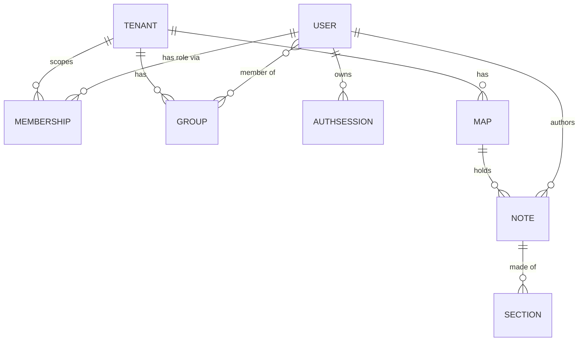
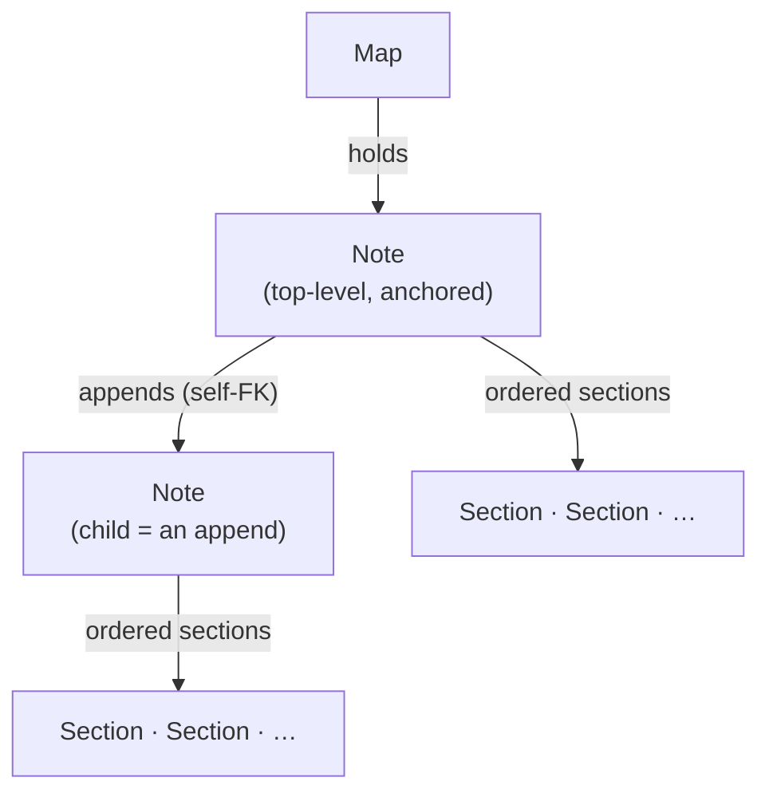

<!-- doc-status: dated -->

# The domain model

- Date: 2026-07-21
- Prerequisite: none — a `foundation-` primer. Its companion is
  [the visibility model](foundation-visibility-model.md); this one is the
  *nouns*, that one is how those nouns decide who-sees-what.
- Describes: `backend/core/models.py` (the shared base + identity/tenancy) and
  `backend/maps/models.py` (the map content).

The backend is a small number of tables, but two ideas shape all of them: **a
shared base class hands every table the same machinery** (UUID keys, soft
delete, versioning, timestamps), and **a `Tenant` scopes the content while a
`User` stays global**. Get those two and the rest reads quickly.

---

## 1. The shape



Read it as two clusters that meet at `Note`: an **identity** side (`User`,
`Group`, `Membership`, `AuthSession`) and a **content** side (`Map` → `Note` →
`Section`). A `User` authors notes; everything else about who-sees-what is the
visibility model reading this same graph. (`Note` also references *itself* — an
append is a child note — which §4 draws on its own so the reflexive edge stays
legible.)

## 2. What every row gets for free (`BaseModel`)

Every table inherits `BaseModel`, an abstract model that supplies four things so
no individual table has to reimplement them:

```python
class BaseModel(models.Model):
    id = models.UUIDField(primary_key=True, default=uuid.uuid4, editable=False)
    created_at = models.DateTimeField(auto_now_add=True)
    updated_at = models.DateTimeField(auto_now=True)
    version = models.PositiveIntegerField(default=0)
    deleted_at = models.DateTimeField(null=True, blank=True)
```

- **UUID primary keys.** Every id is a random UUID, not a sequential integer —
  ids can be minted client-side, don't leak row counts, and don't collide across
  environments.
- **Timestamps.** `created_at` / `updated_at`, maintained automatically.
- **A version counter for optimistic concurrency.** `save()` increments
  `version` every time. Two people editing the same note can be detected: an
  edit that carries a stale `version` is a conflict (the write API turns that
  into an HTTP 409 rather than silently clobbering).
- **Soft delete, with a two-manager trick.** Deleting sets `deleted_at` rather
  than removing the row (`soft_delete()`), and there are *two* managers:

  ```python
  all_objects = models.Manager()          # everything, including soft-deleted
  objects     = SoftDeleteManager()        # filters deleted_at IS NOT NULL out

  class Meta:
      default_manager_name = "objects"     # normal queries / the API hide deleted rows
      base_manager_name    = "all_objects" # related lookups / prefetch still resolve them
  ```

  The split is the subtle part. `objects` (the default) hides deleted rows, so
  the API never serves them. But `base_manager_name` — the manager Django uses
  for *following a foreign key* — is the **unfiltered** one, so a prefetch or a
  parent lookup doesn't break just because an ancestor was soft-deleted.
  Subclasses inherit this `Meta`; overriding it back to the plain manager would
  silently leak deleted rows, which is why the base spells it out.

## 3. Tenancy: content is scoped, identity is global

Two abstract bases sit between `BaseModel` and the concrete tables:

- **`Tenant`** is the isolation boundary — an organization/space.
- **`TenantScopedModel`** adds a `tenant` foreign key. `Map`, `Note`, and
  `Group` are tenant-scoped: they belong to exactly one tenant.

The deliberate asymmetry: **`User` is *not* tenant-scoped.** A person is one
global identity that can participate in many tenants. Their relationship *to* a
tenant is modeled explicitly:

- **`Membership`** — a `(user, tenant, role)` row, `role ∈ {owner, contributor,
  viewer}`, unique per user-per-tenant. This is the coarse "what may you do in
  this tenant" grant.
- **`Group`** (tenant-scoped, `members` is a many-to-many of users) — the finer
  "who is in this audience," which the visibility model's `Audience` rule reads.

So "can act in a tenant" (`Membership.role`) and "is in this friend circle"
(`Group` membership) are separate axes, which is why the model keeps them in
separate tables.

## 4. The content tree: `Map` → `Note` → `Section`

The content side is a shallow tree. A map holds top-level notes; a note both
carries its own ordered sections *and* can hold child notes (its appends), each
of which is itself a note with its own sections:



- **`Map`** (tenant-scoped) — a `name`, a `center` point, a default zoom. It
  holds notes.
- **`Note`** (tenant-scoped) — authored by a `User`, anchored to the map by
  **exactly one** of a `point`, an `area` (polygon — also used for circles), or
  a `path` (line). That "exactly one" is enforced in the database:

  ```python
  models.CheckConstraint(
      condition=(
          models.Q(parent__isnull=False)   # an append carries no anchor
          | models.Q(point__isnull=False, area__isnull=True, path__isnull=True)
          | models.Q(point__isnull=True, area__isnull=False, path__isnull=True)
          | models.Q(point__isnull=True, area__isnull=True, path__isnull=False)
      ),
      name="note_top_level_exactly_one_anchor",
  )
  ```

- **Appends are notes.** A `Note` has a self-referential `parent`
  (`related_name="appends"`), so a reply/append is *another Note* whose parent is
  set. One table models both top-level notes and their appends; the constraint
  above exempts appends (they have no anchor of their own) and requires exactly
  one anchor of everything top-level.
- **`Section`** — a note is an *ordered list of sections* (`Meta.ordering =
  ["order"]`), each one `content` plus its own visibility rule (`rule_type` +
  `rule_params`). Section is the unit the [visibility
  model](foundation-visibility-model.md) resolves; everything interesting about
  per-viewer access happens here.

`Note` also carries three sandbox-only fields — `is_seed`, `session_key`,
`created_ip` — meaningful only under `SANDBOX_MODE` (the public demo), used to
mark permanent seed content and to attribute/rate-limit anonymous creations.

## 5. Identity and audit

- **`User`** — `display_name`, a `reputation` integer (the attribute the
  `AttributeGate` visibility rule gates on), an optional unique `email`, and a
  `password` hash that is **blank by default**, which the login path treats as
  unusable — an account with no password set can't be authenticated. (The seeded
  demo personas *do* have a password — the shared demo credential — so they can be
  logged in as; they can *also* be previewed via `preview_as` without logging in.)
- **`AuthSession`** — a bearer-token session that stores **only the SHA-256 hash
  of the token**, never the token itself, alongside its expiry, creator IP, and
  user agent. A leaked database row can't be replayed as a session.
- **`AuditEvent`** — an append-only log (`action`, `target_type`, `target_id`,
  a JSON `metadata` blob, the actor). Never updated or deleted; its tenant FK is
  `SET_NULL` so the log outlives the tenant it describes.

## 6. Where it lives

```
core/models.py
  BaseModel            UUID pk + timestamps + version + soft-delete (the shared base)
  Tenant               the isolation boundary
  TenantScopedModel    BaseModel + a tenant FK (abstract)
  User                 global identity (reputation, optional login)
  AuthSession          hash-only bearer sessions
  Group, Membership    tenant grouping (audience) and roles
  AuditEvent           append-only event log
core/managers.py
  SoftDeleteManager    the one-line "hide deleted_at rows" default manager
maps/models.py
  Map                  a tenant's map (center + zoom)
  Note                 point/area/path-anchored, author, self-FK appends, sandbox meta
  Section              ordered content unit that carries a visibility rule
```

`core/` holds the tenant-agnostic base and identity; `maps/` holds the
map-specific content. Every concrete table is a thin set of fields on top of
`BaseModel`, which is what keeps "UUID keys, soft delete, versioning" a
one-line inheritance rather than a per-table chore.

## Where to go next

- [The visibility model](foundation-visibility-model.md) — how a `Section`'s
  rule and a viewer produce visible/teaser/hidden.
- The **write path** — how notes, sections, and appends are created and edited,
  where the `version` counter becomes a 409, and the asymmetric append
  permissions — is a natural next walkthrough.
