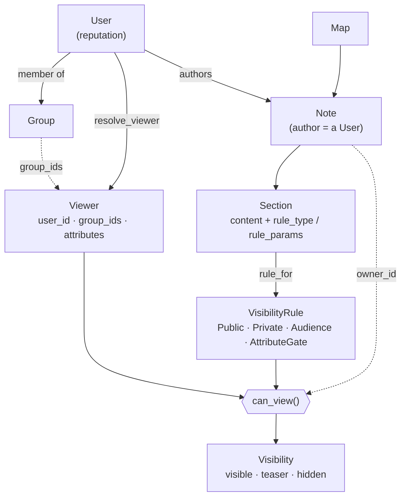

<!-- doc-status: dated -->

# The visibility model

- Date: 2026-07-21
- Prerequisite: none — this is a `foundation-` primer. It's the concept the
  backend is built around; the backend walkthroughs assume this vocabulary
  ("viewer", "section", "visible/teaser/hidden", "rule").
- Describes: `backend/core/visibility/` (the pure engine),
  `backend/maps/visibility.py` (the persistence bridge), and how
  `backend/maps/api.py` wires it into a request.

This is the single most load-bearing idea in the backend, and the thing that
makes the app more than a pin-dropper: **the same note shows a different face to
each viewer, decided per piece of content, by a small pure engine.** Everything
else — the "viewing as" persona switcher, the reputation gates, the tour's live
persona swap — is that engine seen from the outside.

---

## 1. The one-paragraph version

A note isn't one blob of text. It's an ordered list of **sections**, and *each
section carries its own visibility rule*. When someone requests a note, the
backend resolves who they are into a **Viewer**, then asks, for every section,
one question: **may this viewer see this?** The answer is one of three —
**visible**, **teaser**, or **hidden** — and the response is assembled from
those answers. Two people hitting the same URL get genuinely different JSON.

## 2. The shape it sits on

Just enough of the data model to follow the rest (full model tour is a separate
explainer):

- A **Map** belongs to a **Tenant** and holds **Notes**.
- A **Note** is authored by a **User** and anchored to a point/area/path on the
  map. It owns an ordered list of **Sections** (`Section.order`).
- A **Section** is one unit of content (`Section.content`) *plus its own
  visibility rule* (`rule_type` + `rule_params`, stored on the row).
- A **User** has a `reputation` number and can belong to **Groups**.
- The reader might be a logged-in user, an anonymous visitor "previewing as" a
  demo persona, or a **guest** (nobody).

So visibility is decided at the **section** level, not the note level. One note
can have a public teaser section, a friends-only section, and a
reputation-gated section, all at once.

Visually — the two sides (who's looking, what's being read) meet at one
function, `can_view`, which produces the answer. Everything below is a closer
look at each box:



(A full entity-relationship diagram of the whole data model belongs in the
domain-model explainer; this one is scoped to the visibility mechanism.)

## 3. The pure engine (`core/visibility/`)

The heart is four small pieces with **no database access and no Django** — just
data and functions. That purity is deliberate (see §6); it's why the whole
model is unit-testable in isolation.

### Viewer — *who is looking*

```python
@dataclass(frozen=True)
class Viewer:
    user_id: UUID | None = None
    group_ids: frozenset[UUID] = frozenset()
    attributes: Mapping[str, float] = {}   # e.g. {"reputation": 42.0}
```

A **guest is just `Viewer()`** — no id, no groups, no attributes. That emptiness
is load-bearing: a guest automatically fails every rule that needs an identity,
without any special-casing.

### VisibilityRule — *the question a section asks*

A rule answers exactly one thing: `grants(viewer) -> bool`. There are four:

| Rule | Grants when… |
|---|---|
| `Public` | always |
| `Private` | never |
| `Audience(user_ids, group_ids)` | the viewer is one of those users, **or** is in one of those groups |
| `AttributeGate(attribute, threshold)` | the viewer's attribute (e.g. `reputation`) is present **and** `>= threshold` |

`AttributeGate` is where the "earn your way in" behavior lives — a section gated
at `reputation >= 50` is invisible to a guest (no `reputation` attribute at all)
and to low-rep users, and appears once they cross the line.

### Visibility — *the three-way answer*

```python
class Visibility(Enum):
    VISIBLE = "visible"   # you get the content
    TEASER  = "teaser"    # you get a "there's something here" placeholder, no content
    HIDDEN  = "hidden"    # you get nothing; the section is dropped entirely
```

The middle state is the interesting one. **Teaser** is how the UI can honestly
say "this author wrote a members-only note here" without leaking the note —
locked, but visible-as-locked. **Hidden** is stronger: the section vanishes so
completely the viewer can't tell it exists.

### can_view — *the engine itself*

```python
def can_view(viewer, *, owner_id, rule, teaser=False) -> Visibility:
    if viewer.user_id is not None and viewer.user_id == owner_id:
        return Visibility.VISIBLE          # owner-sees-all, before any rule
    if rule.grants(viewer):
        return Visibility.VISIBLE
    return Visibility.TEASER if teaser else Visibility.HIDDEN
```

That's the entire decision, and its order matters: **owner-sees-all is checked
first** (an author never locks themselves out of their own content), *then* the
rule, and only a denied viewer falls through to the teaser-vs-hidden choice.
Pure and deterministic — same inputs, same answer, no I/O.

## 4. From a stored row to a rule (`maps/visibility.py`)

The engine speaks in `VisibilityRule` objects, but the database stores a
section's rule as two plain columns: `rule_type` (an enum:
`public`/`audience`/`attribute_gate`/`private`) and `rule_params` (JSON, e.g.
`{"attribute": "reputation", "threshold": 50}`). `rule_for(section)` is the
bridge — a `match` on `rule_type` that builds the right rule object.

The important detail is what it does when the data is *bad*:

```python
case _:
    return Private()          # unknown rule_type → fail closed
except (KeyError, ValueError, TypeError):
    return Private()          # malformed rule_params → fail closed
```

**Every failure path returns `Private` (deny).** A typo'd rule type, a missing
`threshold`, a corrupt JSON blob — none of them can accidentally *expose*
content. The worst a bad rule can do is hide something that should have shown.
That's the "fail closed" property, and it's the whole reason this mapping is a
named function with explicit error handling rather than a dict lookup.

`section_visibility(section, viewer, owner_id)` is then a one-liner tying the two
halves together:

```python
return can_view(viewer, owner_id=owner_id, rule=rule_for(section), teaser=section.teaser)
```

## 5. How a request actually uses it (`maps/api.py`)

Reading the notes on a map (`GET /maps/{id}/notes`) is three moves:

**1. Resolve identity** — `resolve_identity(request, preview_as)`:

```python
if user := user_from_bearer(request):          # a real, logged-in user
    return Identity(user_id=user.id, is_authenticated=True)
if settings.SANDBOX_MODE and preview_as is not None:
    return Identity(user_id=preview_as, is_authenticated=False)   # "viewing as" a persona
return Identity(user_id=None, is_authenticated=False)             # guest
```

This is a security boundary worth pausing on. A valid **bearer token always
wins**; `preview_as` (the demo's persona switcher) is honored **only** when
there's no authenticated user *and* only under `SANDBOX_MODE`. So `preview_as`
is not "impersonate anyone" — outside the sandbox it's ignored entirely, and it
can never override a real login.

**2. Resolve the viewer** — `resolve_viewer(user_id, tenant)` turns that id into
a `Viewer`, loading the user's groups *in this tenant* and their reputation as
an attribute. `None` (guest) → `Viewer()`.

**3. Filter, section by section** — `_visible_sections(note, viewer)` runs
`section_visibility` on each section and assembles the output:

- **HIDDEN** → the section is skipped; it never appears in the response.
- **VISIBLE** → the section's `content` is included.
- **TEASER** → `content` is `null`, but `teaser_text` is included so the UI can
  render the locked placeholder.

Then one more rule at the note level: **a note with zero visible sections is
dropped from the response entirely** — no title, no coordinate. A fully-private
note doesn't leak its existence as a pin on the map.

## 6. Why it's built this way — the security properties

Each design choice buys a property you can state plainly:

- **Pure engine, no I/O.** The whole model is data + functions with no database,
  so it's exhaustively unit-testable and the security-critical logic is ~30
  lines you can read in one sitting. Persistence and request concerns live in
  outer layers.
- **Fail closed everywhere.** Unknown rule type, malformed params, missing
  attribute — all deny. There is no code path where a mistake *reveals* content.
- **Owner-sees-all is a property of the engine, not each rule.** Checked once,
  first; individual rules never have to remember to exempt the author.
- **The empty guest.** `Viewer()` needs no special cases — it fails
  identity-based and attribute-based rules by construction.
- **Hidden means gone, not flagged.** A denied `content` is never serialized;
  the section is dropped and a fully-hidden note is omitted. The API can't leak
  what it never puts in the payload.
- **`preview_as` is sandbox-scoped and login-subordinate.** The persona switcher
  is a demo affordance, not an authorization bypass.

## 7. Where it lives

```
core/visibility/
  viewer.py     Viewer (who is looking) — pure data
  rules.py      VisibilityRule + Public/Private/Audience/AttributeGate — pure
  engine.py     can_view() + the Visibility enum — the decision, pure
  resolve.py    resolve_viewer(): a user id (in a tenant) → a Viewer  [touches the DB]
maps/visibility.py
                rule_for(): stored row → rule (fail-closed); section_visibility();
                section_label() (the human-readable rule name for the UI)
maps/api.py
                resolve_identity() → resolve_viewer() → _visible_sections();
                the note-level "drop if nothing visible" rule
```

The layering is the point: **`core/visibility/` is pure** (no Django, no DB),
`maps/visibility.py` knows how rules are *stored*, and `maps/api.py` knows how a
*request* supplies a viewer. Each layer only depends inward.

## Where to go next

- The **write path** — how sections and their rules are created/edited, and the
  asymmetric append permissions (anyone may append to a note; only the author
  edits their own) — is a natural next walkthrough.
- The engine's tests (`backend/core/tests/`, `backend/maps/tests/`) are the
  executable version of §6 if you want to see each property pinned down.
