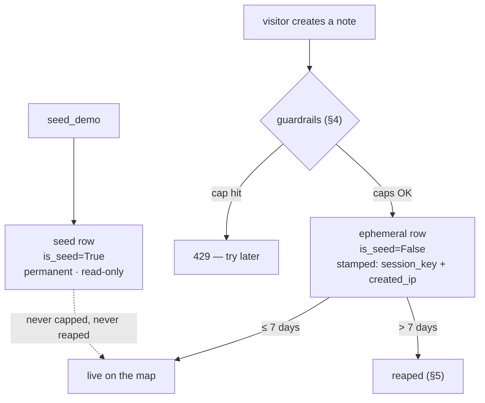

<!-- doc-status: dated -->

# Sandbox mode: a public, writable demo that stays safe and cheap

- Date: 2026-07-22
- Prerequisites: [the domain model](foundation-domain-model.md) (`is_seed`,
  `session_key`, `created_ip` on `Note`), [authentication and
  identity](auth-and-identity.md) (`preview_as`, the demo personas), and [the
  write path](write-path.md) (which touches the creation caps in passing — this
  is the full tour).
- Describes: `SANDBOX_MODE` in `backend/annotated_maps/settings.py`,
  `backend/maps/sandbox.py`, `backend/maps/management/commands/reap_ephemeral.py`,
  and the seed (`backend/maps/seed.py`).

The live demo lets *anyone* — no signup — drop notes on a shared map of Boston.
That is a small hosted service that strangers can write to, which raises two
questions the rest of the app doesn't have to: how does it not get **abused**,
and how does it not grow **unbounded** (and expensive)? The answer is a set of
guardrails that switch on only in sandbox mode. This is the tour of all of them.

---

## 1. The switch

```python
SANDBOX_MODE = env.bool("SANDBOX_MODE", default=False)
```

Everything in this document is gated on that flag. **It defaults to off**, so
local development and the test suite behave like an ordinary permissioned app —
no anonymous writing, no caps, no personas-without-login. The public Render
deploy sets `SANDBOX_MODE=true` (the static frontend sets `VITE_SANDBOX=true` to
match). So "sandbox mode" is precisely the delta between the demo and a normal
tenant.

## 2. Two kinds of content: seed vs. ephemeral

The single most important distinction is the `is_seed` boolean on every `Note`:

- **Seed content** (`is_seed=True`) — the curated Boston demo (the personas'
  notes, the visibility showcase). Written by `seed_demo`, **permanent**, and
  **read-only to everyone**. It is the thing a first-time visitor is meant to
  see, so nothing a visitor does can edit, delete, or expire it.
- **Ephemeral content** (`is_seed=False`) — everything visitors create. It is
  the *only* thing the caps count, the reaper deletes, and moderation can touch.

`is_seed` is the dividing line every guardrail keys off. You'll see
`filter(is_seed=False)` throughout — the guardrails act on visitor content and
are blind to the seed by construction, so the demo baseline can't be damaged.



## 3. Who acts, and how they're tracked

The [identity explainer](auth-and-identity.md) covers the two ways to *become* a
persona; sandbox mode is where the anonymous one matters. A visitor can:

- **Log in** as a persona with the shared demo password, or
- **Preview** a persona anonymously via `?preview_as=<id>` — no password, only
  under `SANDBOX_MODE`.

An anonymous previewer can still *write* (creating a note only needs a resolved
`user_id`, which `preview_as` supplies). Since there's no login to attribute that
to, sandbox stamps two things on every ephemeral row so the guardrails have
something to meter and moderation has something to group by:

- **`session_key`** — the Django session, created on demand (`ensure_session`).
  Anonymous per-session caps and "edit only what you made this session" key off
  this.
- **`created_ip`** — the client IP, taken as the **rightmost** `X-Forwarded-For`
  hop. Behind Render's single proxy that last hop is the one Render itself
  appends from the real connection; the leftmost hops are client-forgeable, so
  using `[0]` would let anyone spoof past the per-IP cap. `[-1]` is the trusted
  value.

Neither field is ever exposed by the public note API — only the token-gated
moderation API (a forthcoming explainer) can see them.

## 4. Creation caps (`enforce_create_limits`)

Before any sandbox create succeeds, four caps are checked in order — a `429` on
any one. They fall into two groups by *what they protect*:

**Protect the deploy — apply to everyone** (logged-in or anonymous):

| Cap | Value | Meaning |
|---|---|---|
| `MAX_EPHEMERAL_ROWS` | 2000 | total non-seed rows; the sandbox can't grow without bound |
| `MAX_CREATES_PER_IP_PER_HOUR` | 30 | throttle a single network's burst |

**Meter anonymous visitors — per session** (authenticated creators are bucketed
by author id, so these don't apply to them):

| Cap | Value | Meaning |
|---|---|---|
| `MAX_NOTES_PER_SESSION` | 15 | top-level notes per anonymous session |
| `MAX_APPENDS_PER_SESSION` | 30 | appends per anonymous session |

These are deliberately **soft**: count-then-create isn't atomic, so a small
overshoot under concurrency is accepted rather than paying for a lock — fine for
a demo. And they're a distinct failure class from the permission model: caps
raise `429` ("slow down / full"), whereas the author-only rules raise `403`
(covered in the [write path](write-path.md)).

## 5. The reaper (`reap_ephemeral`)

Caps bound how *fast* the sandbox fills; the reaper bounds how *long* anything
lives. It's a management command run as a Render cron job (daily, `17 4 * * *` —
04:17 UTC):

```python
cutoff = timezone.now() - timedelta(days=TTL_DAYS)   # TTL_DAYS = 7
qs = Note.all_objects.filter(is_seed=False, created_at__lt=cutoff)
qs.delete()   # HARD delete, cascades to child appends + sections
```

Three things worth noting:

- **Seed is spared** (`is_seed=False` filter) — the demo baseline never expires.
- **`all_objects`** is used, so already-soft-deleted rows are purged for real too
  (a soft delete hides a row; the reaper reclaims the space).
- **A stale parent takes its whole thread.** The `delete()` cascades
  (`on_delete=CASCADE`) to a note's appends and sections — so an old top-level
  note is swept as a *unit*, carrying even recently-added appends with it. That's
  intentional for a sandbox: a thread ages out whole rather than piecemeal. (Note
  the contrast with the [write-path](write-path.md) *soft* delete, which does not
  cascade — that's the gap issue #142 tracks; the reaper's *hard* delete is a
  different path and does cascade.)

## 6. What sandbox does *not* relax

Sandbox mode adds guardrails; it doesn't loosen the permission model. Editing and
deleting are still ownership-gated by `authorize_write` (the [write
path](write-path.md)), with two sandbox-specific tightenings:

- **Seed content is read-only** — `authorize_write`/`is_editable` reject any write
  to an `is_seed` row, even by an authenticated user.
- **Anonymous edits are session-scoped** — a previewer may edit only rows whose
  `session_key` matches their own session, so one visitor can't alter another's
  contributions.

## 7. Where it lives

```
annotated_maps/settings.py
  SANDBOX_MODE            the master switch (default False)
maps/sandbox.py
  enforce_create_limits   the four creation caps (429) — deploy-wide + per-session
  client_ip               rightmost X-Forwarded-For (proxy-trusted)
  ensure_session          lazily mint the session key anonymous caps meter
  authorize_write / is_editable   edit-ownership incl. seed read-only + session scope
maps/management/commands/reap_ephemeral.py
  the 7-day TTL hard-delete (seed spared; cascades to appends + sections)
maps/seed.py
  seed_demo's cast + content, all stamped is_seed=True (permanent)
```

Read together: `is_seed` splits permanent demo from disposable visitor content;
caps bound the fill rate and per-visitor volume; the reaper bounds lifetime; and
the ordinary permission model still applies on top. None of it exists outside
`SANDBOX_MODE`.

## Where to go next

- A forthcoming **moderation API** explainer — the token-gated operator tool that
  reads the `session_key`/`created_ip` this doc describes, to clean up abuse the
  automated caps didn't stop.
- [The write path](write-path.md) — the `403` permission model the sandbox caps
  (`429`) sit alongside.
