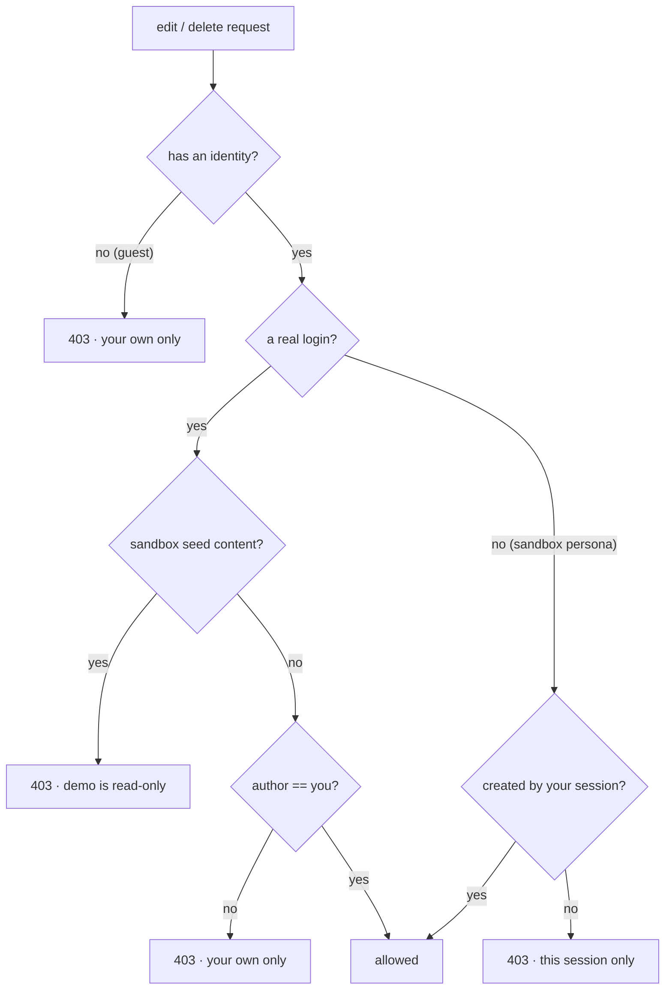
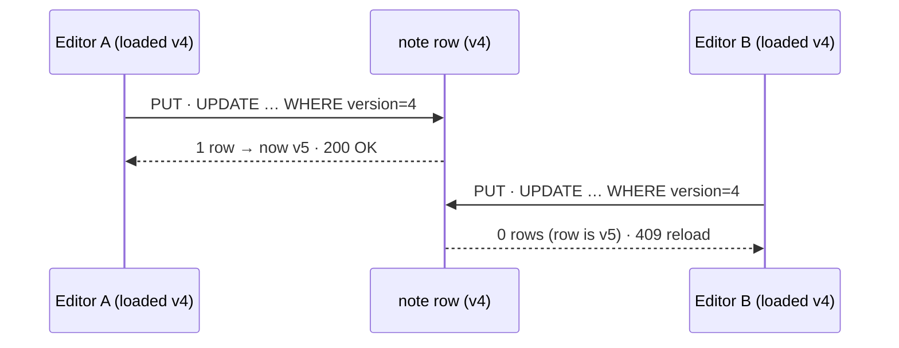

<!-- doc-status: dated -->

# The write path: creating and editing notes

- Date: 2026-07-21
- Prerequisites: the two backend foundations — [the domain
  model](foundation-domain-model.md) (`Note`, `Section`, appends-are-notes, the
  `version` counter) and [the visibility model](foundation-visibility-model.md)
  (how a request resolves into an identity). This walkthrough is the *write*
  counterpart to that read-side tour.
- Describes: the write endpoints in `backend/maps/api.py` and the authorization
  in `backend/maps/sandbox.py`.

The visibility model is entirely about *reading* — the same note shown a
different face per viewer. Writing is a separate set of rules, and they are
deliberately **asymmetric**: contributing is open, but changing what already
exists is locked to its author. Two racing edits are resolved by an
optimistic-concurrency check rather than a lock. This is a tour of both.

---

## 1. The endpoints

Every write resolves the caller into an `Identity` first (the same
`resolve_identity` the read path uses), then applies one of two permission
rules — *may create* or *may edit* — before touching the database.

| Method + path | Does | Who may |
|---|---|---|
| `POST /maps/{id}/notes` | create a top-level note | any established identity |
| `POST /notes/{id}/appends` | append to a top-level note | any established identity |
| `PUT /notes/{id}` | edit a note (title, anchor, sections) | the note's author only |
| `PUT /appends/{id}` | edit an append | the append's author only |
| `DELETE /notes/{id}` | soft-delete a note | the note's author only |
| `GET /notes/{id}/edit` | load a note for editing (with its `version`) | the note's author only |

"Any established identity" means a resolved `user_id` — a real logged-in user,
or (under `SANDBOX_MODE`) a demo persona being previewed. A guest — no identity —
can read but never write; every create endpoint opens with:

```python
if identity.user_id is None:
    raise HttpError(403, "Sign in to add notes.")
```

## 2. The asymmetry: appending is open, editing is author-only

This is the shape worth internalizing. **Anyone signed in may append to anyone's
note**, but **only the author may edit or delete** what they wrote:

- `create_append` checks *only* that you have an identity and that the parent is
  a top-level note. It never checks who authored the parent. So appends are
  public commentary — any participant can add to any note.
- `update_note`, `update_append`, and `delete_note` all first call
  `authorize_write`, which enforces author-ownership. You control only the rows
  you created.

`authorize_write` is the whole edit-permission rule, and it fans out by *how* the
identity was established:



The two "allowed" paths mirror the two kinds of identity: a **real login** owns a
row when `note.author_id == user_id`; an **anonymous sandbox visitor** (who never
authenticated) owns a row when its `session_key` matches their session. Either
way, **seed content is read-only** — the seeded demo personas and their notes
can't be edited out from under the next visitor. The read API surfaces the same
predicate as an `editable` flag (via `is_editable`, the boolean twin of
`authorize_write`) so the UI can hide edit affordances the server would reject.

Appends are also capped at one level deep: `create_append` refuses a parent that
is itself an append (`parent.parent_id is not None → 400`), and `update_append`
refuses a target that is *not* an append (`parent_id is None → 400`, "use
`PUT /notes/{id}`"). A note is either top-level or a direct child — never a
grandchild.

## 3. Concurrent edits: the `version` counter becomes a 409

Every row carries a `version` (from `BaseModel`; see the [domain
model](foundation-domain-model.md)). `GET /notes/{id}/edit` hands the client the
current `version`, and the client must send it back on `PUT`. That number is how
two people editing the same note at once are kept from silently clobbering each
other — **optimistic concurrency**: no lock is held; the conflict is detected at
write time.

The detection is a single atomic statement — claim the row *only if* its version
is still what you loaded:

```python
claimed = Note.objects.filter(id=note.id, version=payload.version).update(
    version=F("version") + 1,
    updated_at=timezone.now(),
    title=payload.title,
    **anchor,
)
if not claimed:
    raise HttpError(409, "This note changed elsewhere — reload to edit.")
```

`UPDATE … WHERE id = ? AND version = ?` either matches one row (and bumps it) or
matches zero. The database serializes the two writes, so exactly one wins:



Two details the code calls out in comments:

- **`.update()` bypasses `BaseModel.save()`**, so it can't rely on the usual
  auto-increment of `version`/`updated_at` — both are bumped explicitly in the
  same statement. That's deliberate: doing the read-check-write as one SQL
  `UPDATE` is what makes it atomic. A `save()` would re-read and re-write in two
  steps, reopening the race.
- **The in-memory object is stale afterward** (the raw `UPDATE` didn't touch it),
  so the handler ends with `note.refresh_from_db()` before returning the new
  `version`.

## 4. Sections are replaced wholesale

A note's sections aren't patched field by field. On every edit the handler
deletes all existing sections and recreates them from the payload, inside the
same transaction as the version claim:

```python
note.sections.all().delete()          # hard delete — see below
for s in payload.sections:
    Section.objects.create(note=note, order=s.order, content=s.content, ...)
```

One sharp edge the code flags: `QuerySet.delete()` issues a **hard** SQL
`DELETE`, even though `Section` is soft-deletable. That's intentional for now —
sections have no independent history to preserve — but it's the seam a future
revision-history feature will have to change (snapshot or soft-delete instead of
dropping the rows). It's called out in a comment precisely so that future work
doesn't assume the soft-delete manager protected these rows.

## 5. Creation caps (sandbox only)

Outside `SANDBOX_MODE` (local dev, tests) creation is unrestricted. On the public
demo, `enforce_create_limits` guards the shared deploy before a create succeeds,
and returns the `session_key` + client IP to stamp on the new row:

- a **global** cap on non-seed rows (the sandbox can't grow without bound),
- a **per-IP hourly** cap (applies to everyone, authenticated or not),
- **per-session** note/append caps (anonymous creators only — authenticated ones
  are bucketed by author id).

These are demo blast-radius guards, not part of the permission model; the caps
raise `429`, distinct from the `403`/`409` above. The client-IP derivation has
its own subtlety (trust the *rightmost* `X-Forwarded-For` hop behind Render's
single proxy) — documented at `client_ip` in `sandbox.py`.

## 6. Where it lives

```
maps/api.py
  create_note      POST /maps/{id}/notes      — create, guest-blocked, sandbox-capped
  create_append    POST /notes/{id}/appends   — append to any top-level note
  note_for_edit    GET  /notes/{id}/edit      — author-only; hands out the version
  update_note      PUT  /notes/{id}           — author-only; atomic version claim → 409
  update_append    PUT  /appends/{id}         — author-only; same claim
  delete_note      DELETE /notes/{id}         — author-only; soft delete
maps/sandbox.py
  authorize_write  the edit/delete permission rule (raises 403)
  is_editable      the same rule as a bool, for the read API's `editable` flag
  enforce_create_limits   the sandbox creation caps (raises 429)
```

The division of labor: `api.py` owns the *create* rules (who may add, one-level
appends) and the *concurrency* rule (the atomic version claim); `sandbox.py` owns
the *edit-ownership* rule and the demo caps. Reading is the [visibility
model](foundation-visibility-model.md); writing is these two files.

## Where to go next

- [The visibility model](foundation-visibility-model.md) — the read side: how the
  `editable` flag's sibling, `section_visibility`, decides what each viewer sees.
- The tests (`backend/maps/tests/`) pin the 409 race and the author-only rule as
  executable examples.
