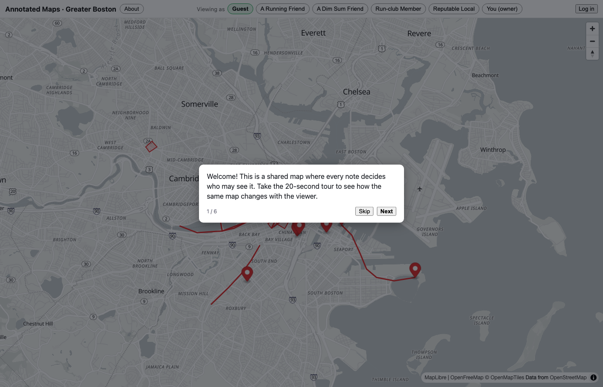

<!-- doc-status: dated -->

# Milestone 3 — live demo run (evidence)

A record of standing the AWS environment up for real, verifying it end-to-end,
and tearing it back to zero. This is the proof behind the roadmap's Milestone 3
"done means: `terraform apply` to a working, load-balanced deployment on EKS;
`terraform destroy` back to zero."

- **Date:** 2026-07-14
- **Account:** a fresh, dedicated AWS account (identity via IAM Identity Center SSO — no long-lived keys).
- **What ran:** the committed Terraform + `make demo-up` / `make demo-down`, unmodified from the repo.

## The app, live on EKS behind an ALB

`make demo-up` provisioned the environment and deployed the chart; the app
served real traffic through an AWS Application Load Balancer at
`http://k8s-annotate-…​.us-east-1.elb.amazonaws.com/`. The full seeded
application rendered — the persona switcher, the Boston map with annotation pins
and running routes, and the guided tour — all served by EKS pods talking to Neon:



Cluster state at the time (2× API + 1× web pod Running across two nodes, the
migration hook `Completed`):

```
NAME                                  READY   STATUS      NODE
annotated-maps-api-…-h6rt9            1/1     Running     ip-10-0-130-197
annotated-maps-api-…-tntbd            1/1     Running     ip-10-0-159-148
annotated-maps-web-…-cs576           1/1     Running     ip-10-0-130-197
annotated-maps-migrate-…             0/1     Completed   ip-10-0-130-197
```

`demo-up`'s own smoke test passed both checks — `health OK` (the API through the
ALB) and `web OK` (the SPA) — before printing the URL.

## Timeline

| Phase | Result |
|---|---|
| `terraform apply` (VPC, EKS control plane + nodes, ECR, IRSA) | ~15 min; 61 resources created |
| Cycle 1 | **failed** at image build — Docker Desktop wasn't running (environmental) |
| Cycle 2 | **failed** at the pre-install migration hook — a real chart bug (below); cluster kept up, so the retry was cheap |
| Cycle 3 | **green** — chart deployed, migration `Completed`, smoke passed, app served through the ALB |
| Exercise | headless load + screenshot of the app through the ALB; synthetic traffic |
| `make demo-down` | `Destroy complete! Resources: 61 destroyed`; post-destroy sweep (state / load balancers / NAT gateways / EKS clusters) **all empty** |

## Bugs the live run caught

The reason to spend real money on one real deploy: it exercised code paths the
test suite never had. Two, both now fixed and recorded in
[lessons-learned](lessons-learned.md):

1. **The migration Secret had to become a pre-install hook on the external-DB
   path.** With an external database the migration runs `pre-install`, but the
   shared Secret was a main-phase resource created *after* pre-install hooks — so
   the hook (and the app pods) hit "secret not found." Milestone 1 had only ever
   tested the in-cluster-DB path (`post-install`, Secret already present), so this
   was never run until live AWS. Fixed by gating the Secret as a pre-install hook
   at a lower weight than the migration hook when the DB is external.
2. **Docker daemon not running** — environmental, but it motivated confirming the
   deploy script resumes cheaply after a mid-way failure (the already-applied
   cluster made the retry a fast no-op instead of a full re-provision).

## Cost

Roughly **$0.25–0.40** for the ~1–1.5 hours of cluster time across the three
cycles (EKS control plane + 2× t3.medium + one NAT gateway + the ALB, ~$0.25/hr).
AWS Cost Explorer on a brand-new account lags ~24h before it reports, so
`make demo-cost` reads unavailable immediately after the run — the figure above
is from resource-hours. The `$10` budget alarm (in the persistent foundation
stack) never came close.

## What stays up vs. torn down

- **Torn down to zero** (the ephemeral `demo/` stack): the VPC, EKS cluster, node
  group, ECR repos, and the ALB-controller IRSA role — all 61 resources.
- **Persistent** (the `foundation/` stack, free/pennies): the Terraform state
  bucket, the GitHub OIDC CI role, and the budget alarm. These must outlive a
  demo — the budget always guards the account, and the CI role must exist for a
  PR's `terraform plan` even when nothing is deployed.

## Reproduce it

From the repo, with an AWS profile and a Neon branch (see
[the AWS primer's runbook](aws-primer.md)): `make demo-up` → exercise →
`make demo-down`. About 20 minutes and ~$1–2 per full cycle. It is intentionally
*not* left running — the artifact is this evidence, not an always-on service
(that's the [live Render demo](https://annotated-maps-web.onrender.com/)).
