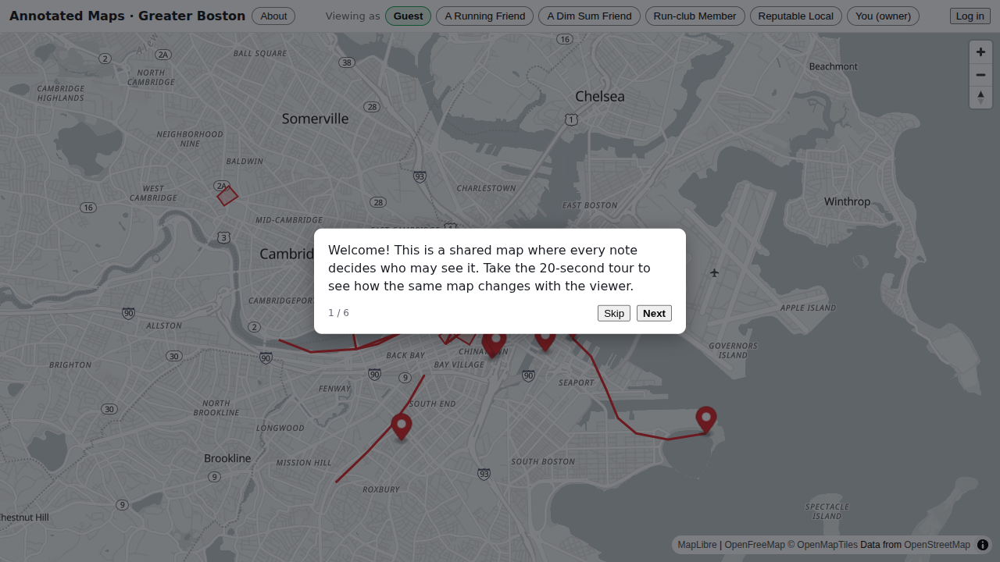

<!-- doc-status: dated -->

# Milestone 4 — the one-button pipeline (evidence)

A record of the capstone running for real: one dispatch that built the entire
AWS environment from nothing, deployed the app, tested it against its live URL,
and tore everything back to zero. This is the proof behind the roadmap's
Milestone 4 "done means: a green public run visible in the Actions history, with
test screenshots attached as artifacts."

- **The run:** [#29447574490](https://github.com/dcltdw/annotated-maps-sp/actions/runs/29447574490) — green, 35 minutes, from `main` at `857a256`.
- **Date:** 2026-07-15.
- **What ran:** the committed [`demo-pipeline.yml`](../.github/workflows/demo-pipeline.yml), unmodified, triggered by `gh workflow run demo-pipeline.yml --ref main`. No human touched anything between the dispatch and the teardown.

## The app, deployed and tested by the pipeline

The `e2e` job drove Playwright against the ALB the `deploy` job had just
created, and captured this. It is the pipeline's own artifact — not a
screenshot taken by hand:



The basemap, the annotation pins, the running routes, the region polygon and
the persona switcher all rendered — which means the whole chain worked: ALB →
nginx pod → Django pods → a per-run Neon database branch → the browser.

## Timeline

One dispatch, five jobs, 35 minutes wall clock:

| Job | Duration | What it did |
|---|---|---|
| `provision` | 14m | `terraform apply` — VPC, EKS, node group, ECR, IRSA (71 resources) |
| `images` | 2m | build → **Trivy gate** (CRITICAL, fixable) → CycloneDX SBOMs → push to ECR |
| `deploy` | 4m | create the per-run Neon branch → ALB controller → `helm upgrade --install` → wait for the ALB → smoke |
| `e2e` | 1m | Playwright against the live ALB URL; screenshots uploaded |
| `destroy` | 12m | `make demo-down` — uninstall, wait for the ALB to actually go, `terraform destroy`, sweep, delete the Neon branch |

Artifacts on the run: **`alb-smoke-screenshots`** (the image above) and
**`image-security`** (Trivy reports + SBOMs for both images).

## Guaranteed teardown, demonstrated rather than asserted

`destroy` carries `if: always()`, so it runs no matter how the run got there.
That was not a theory — **three of the five runs went red, and all five tore
themselves down to zero without a human**:

| Run | Died at | Left behind |
|---|---|---|
| 1 | data-source evaluation | nothing (0 resources created) |
| 2 | node group, after building **67 resources** | nothing |
| 3 | the Trivy gate, with a **live cluster and 2 nodes** | nothing |
| 4 | green, but on hollow evidence (below) | nothing |
| 5 | green | nothing |

After each, the sweep read zero across EKS clusters, EC2 instances, load
balancers, NAT gateways, non-default VPCs, ECR repositories, and Terraform
state. The failure this milestone exists to prevent — a red run silently
stranding billable infrastructure — did not happen once, including on a run
that failed while a cluster was already up.

## What the live runs caught

Every one of these was invisible to static analysis, and all but the last
survived an adversarial code review:

1. **A security control that broke the apply.** A blanket `iam:*` self-Deny on
   the deployer role (added *because* a review recommended it) blocked the EKS
   module's `aws_iam_session_context`, which needs `iam:GetRole` on the caller's
   own role. The review had explicitly checked "nothing legitimate breaks" and
   missed it: the lookup is indirect, module-internal, and caller-relative
   rather than a hardcoded reference. Fixed by denying only the *mutating*
   actions — reads don't escalate.
2. **A half-granted permission.** `iam:CreateServiceLinkedRole` without
   `iam:GetRole` — EKS *reads* the service-linked role to decide whether to
   create it, so node-group creation failed on a cluster that was otherwise up.
3. **A real CVE, caught by the gate it was built for.** The Trivy gate failed
   the web image on `CVE-2026-31789` (openssl heap overflow; `3.3.3-r0` →
   fixed in `3.3.7-r0`) and **skipped the push**, so the vulnerable image never
   reached ECR. The SBOMs were still captured — only because a code review had
   added `if: always()` to those steps. Fixed by patching the base image rather
   than by adding an ignore: the gate's policy is "CRITICAL **and** fixable",
   and this was both.
4. **A test that could not fail.** Run 4 was green *and its evidence was
   worthless*: the smoke asserted the map `canvas` was visible, but maplibre
   creates that canvas instantly, so it passed against a completely blank map
   and screenshotted a grey rectangle. Now it waits for a rendered
   `.maplibregl-marker`, which only appears once the basemap style has loaded
   and the API's seeded notes have arrived. Static gates, a code review, and a
   green live run all missed this — reading the artifact caught it.

Full write-ups: [lessons-learned](lessons-learned.md).

## Cost

Five runs, roughly **$1–1.50 total** — about **$0.20–0.30 per full run**,
dominated by the EKS control plane and NAT gateway for the ~35 minutes each
run exists. Cost Explorer ingests ~24h behind, so `make demo-cost` reports the
authoritative figure a day later; these are resource-hour estimates.

The guardrails that make that safe to be wrong about: a **$10/month budget
alarm**, a `concurrency` group that forbids overlapping runs, `timeout-minutes`
on every job (a hung job would otherwise hold a cluster for the 360-minute
default), and the teardown above.

## What stays up vs. torn down

**Torn down every run:** VPC, EKS, node group, ALB, ECR repositories, the
per-run Neon database branch — everything with a meter.

**Persistent (and ~free):** the Terraform state bucket, the GitHub OIDC
provider, the read-only `annotated-maps-ci` role, the apply-capable
`annotated-maps-deployer` role, the `annotated-maps-alerts` SNS topic, and the
budget alarm. No compute, no load balancers, no NAT.

## Reproduce it

```sh
gh workflow run demo-pipeline.yml --ref main
gh run watch
```

No approval prompt: dispatching requires repo write access and is
fork-unreachable, so a reviewer gate would only re-confirm the same human — and
a gate touching the destroy job could hang teardown, which is the exact failure
this milestone exists to prevent. [ADR-0010](adr/0010-pipeline-apply-role.md)
records that reasoning, along with an honest disclosure of what the deployer
role can actually do in the demo account.

The pipeline also runs unattended on the 3rd of each month, so dependency,
base-image and cloud-API drift surfaces on a schedule rather than the next time
someone needs it to work.
